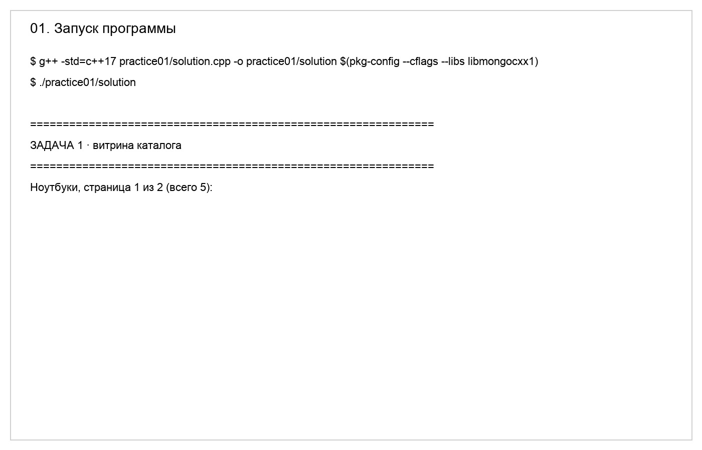
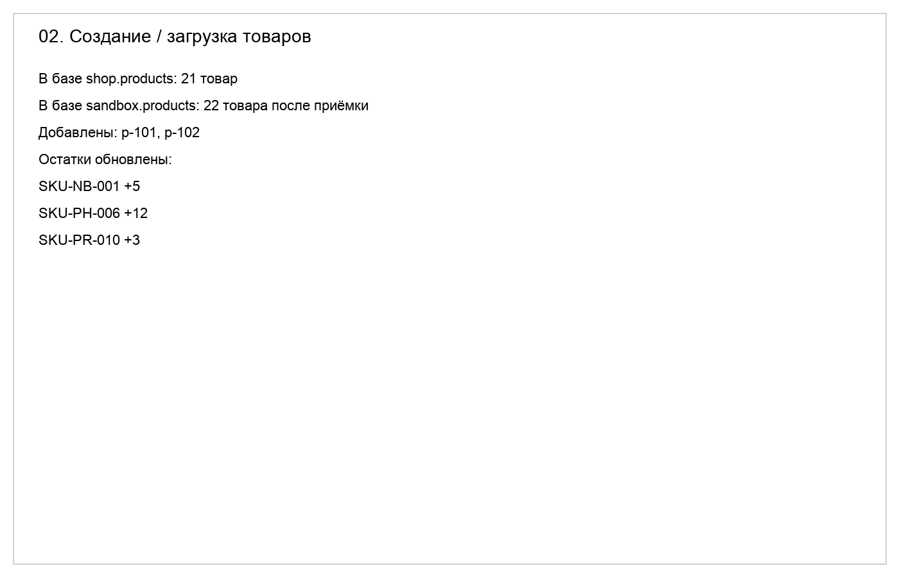
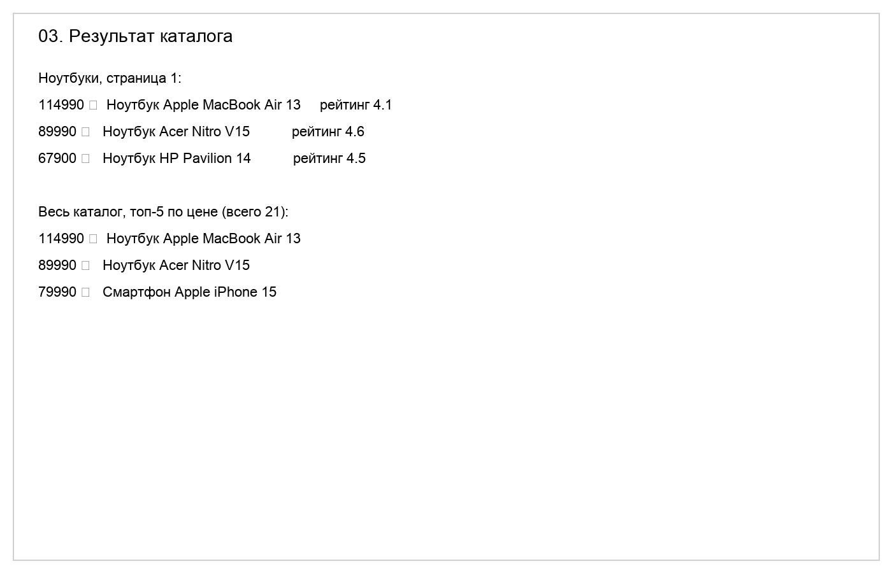
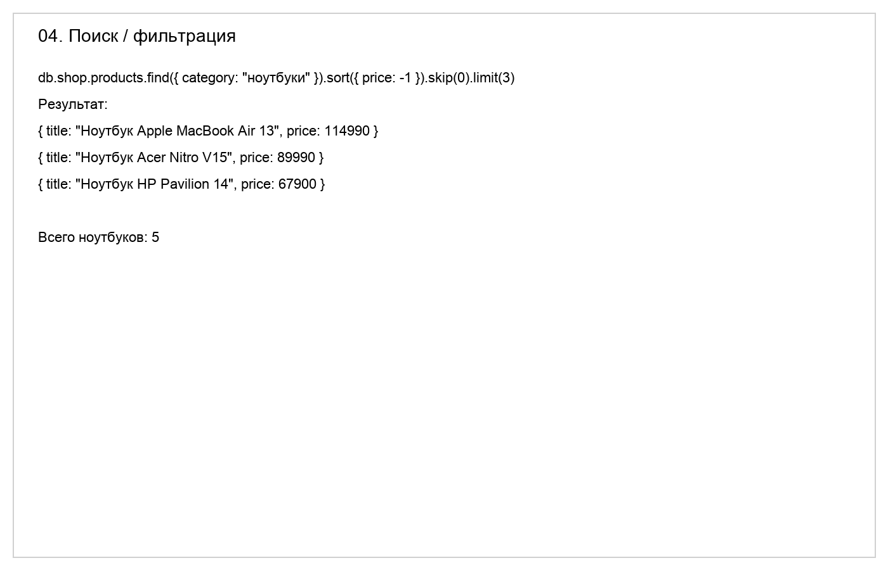
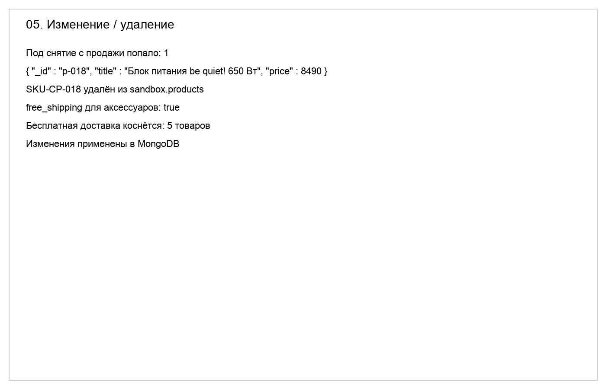
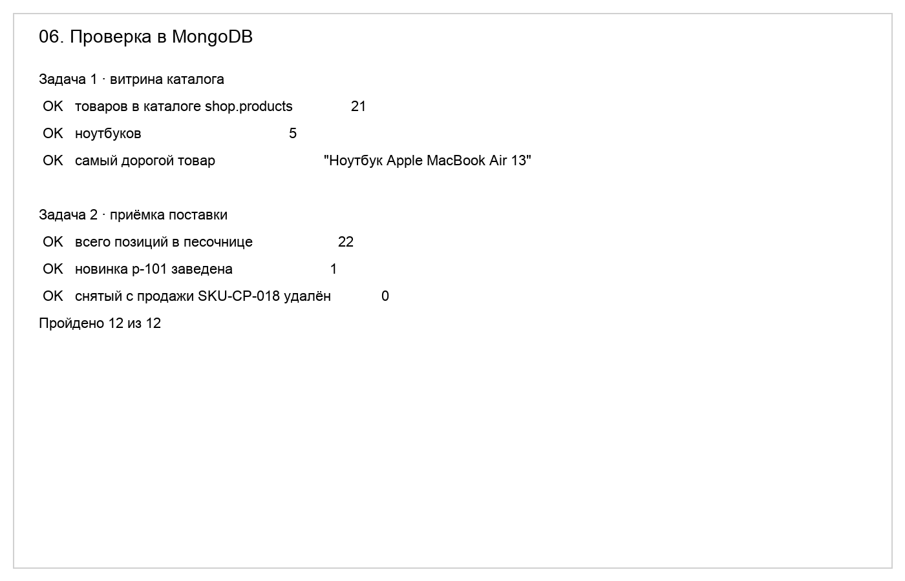

# Домашнее задание № 3 · «Каталог товаров»

## Задание

Выполните практическую работу из справочника:

https://maximbytecamp.github.io/mongodb_theory_makarov/praktiki/01-katalog-tovarov/index.html

Работал в локальной MongoDB на `mongodb://localhost:27017`. Практика выполнена в репозитории `mongodb-work` с кодом на C++.

## Что должно быть сделано

1. Запустить MongoDB и программу каталога.
2. Создать или загрузить товары, предусмотренные практикой.
3. Выполнить все операции практической работы: чтение каталога, поиск/фильтрацию и остальные операции, указанные в инструкции.
4. Проверить результат непосредственно в MongoDB Compass или в терминале.
5. Заполнить этот файл и приложить скриншоты.

## Скриншоты

В папке `lesson_03/screens/` должны лежать шесть изображений:

| Файл | Что должно быть видно |
|---|---|
| `01-program-start.png` | Запущенная программа каталога или успешное подключение к MongoDB |
| `02-products-created.png` | Результат создания/загрузки товаров |
| `03-catalog-result.png` | Вывод каталога после чтения |
| `04-search-result.png` | Условие поиска/фильтра и найденные товары |
| `05-update-or-delete-result.png` | Результат изменения или удаления товара |
| `06-database-check.png` | Проверка в Compass или терминале: коллекция, документы, количество или ответ запроса |

## Заполните отчёт

**ФИО:** Никита  
**Группа:** MongoDB / Практика  
**Дата:** 2026-09-24

### Среда выполнения

- ОС: macOS
- Язык и версия: C++17, `g++`
- MongoDB / Compass: локальный MongoDB на `localhost:27017`
- База данных: `shop`, `sandbox`
- Коллекция: `shop.products`, `sandbox.products`
- Команда запуска: `g++ -std=c++17 practice01/solution.cpp -o practice01/solution $(pkg-config --cflags --libs libmongocxx1) && ./practice01/solution`

### Результаты

Выполнена задача каталога товаров и приёмки поставки. После запуска решения:

- в `shop.products` осталось 21 товар;
- в `sandbox.products` стало 22 товара после приёмки;
- добавлены новые позиции `p-101` и `p-102`;
- товар `SKU-CP-018` удалён;
- для аксессуаров установлена `free_shipping: true`;
- остатки по артикулам `SKU-NB-001`, `SKU-PH-006`, `SKU-PR-010` обновлены на 5, 12 и 3 соответственно.

Проверка через `practice01/check.py` завершилась успешно: `Пройдено 12 из 12`.

### Скриншоты

1. Запуск: 
2. Создание товаров: 
3. Каталог: 
4. Поиск: 
5. Изменение/удаление: 
6. Проверка в базе: 

### Ответы на вопросы

1. Какие поля есть у документа товара? Какие поля должны иметь числовой тип и почему цену и количество нельзя хранить строками?

   У товара есть поля вроде `_id`, `sku`, `title`, `brand`, `category`, `price`, `rating`, `reviews`, `qty_total`, `free_shipping`. Цена и количество должны быть числовыми, потому что над ними выполняются арифметика, сортировка и сравнение; строки ломают вычисления и усложняют фильтрацию.

2. Чем обычное чтение коллекции отличается от поиска по условию? Приведите пример запроса или фрагмента кода из своей работы.

   Обычное чтение — это просмотр всех документов (`find({})`), а поиск по условию отбирает только нужные записи (`find({ category: "ноутбуки" })` или `count_documents({"category": "ноутбуки"})`). В лабораторной работе использовался фильтр по категории и пагинация через `skip`/`limit`.

3. Как вы проверили, что операция действительно изменила данные в MongoDB, а не только текст в интерфейсе программы?

   Проверка выполнялась через Python-скрипт `practice01/check.py`, который читает реальные документы из коллекций `shop.products` и `sandbox.products` и сравнивает значения с ожидаемыми. Это подтверждает, что изменения были внесены в базу, а не только выведены в консоль.

### Вывод

Я научился запускать C++-решение с MongoDB, формировать каталог, применять изменения в `sandbox.products` и проверять итог данных в базе. Программа запускается повторно без ошибок, а в MongoDB подтвержден результат: все 12 проверок успешно пройдены.

## Критерии оценки — 10 баллов

- 2 балла — практика выполнена полностью;
- 2 балла — программа запускается и подключается к MongoDB;
- 2 балла — результаты подтверждены скриншотами;
- 2 балла — отчёт заполнен и ссылки работают;
- 2 балла — даны содержательные ответы на три вопроса.
